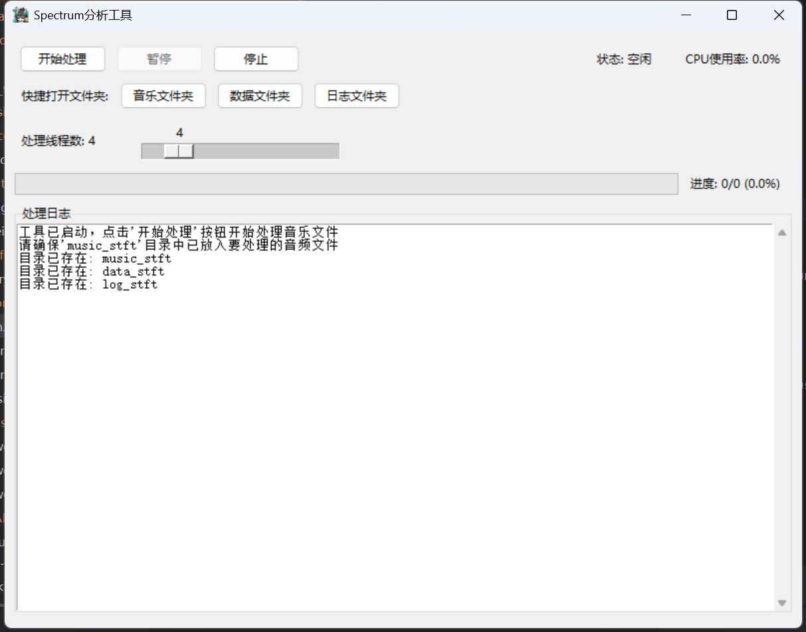

# Spectrum
高中研究性学习所用，代码较为草率，能跑就行。

For senior high school's project study. Don't mention the details if the program can run.

## P 1.1 准备工作

能够看到这个文档，证明你的网络没有问题。

>[!IMPORTANT]
>请确认你已经准备好了 **Git** 和 **Python 3.12** 的环境。

打开IDE（推荐Pycharm），选择克隆仓库。

在这个网页里，找到右上角那个最显眼的绿色按钮（Code），把里面的URL网址复制下来。

在IDE的克隆仓库里面填入该链接，然后等待克隆完成。

## P 1.2 使用

克隆下来之后，运行
``` bash
pip3 install -r requirements.txt -i https://pypi.tuna.tsinghua.edu.cn/simple
```

等待安装完成。

然后，打开tkinter_app.py。

点击右上角绿色开始按钮（三角形那个）。



看到这个界面，你的操作就是正确的。

点击一下开始处理，它会进行一些必要的初始化。

然后，把你下载下来的歌曲直接放进music_stft文件夹里面。

>你可以直接把加密的ncm文件放进文件夹里。现在它会自动解密。

确认文件放置完毕之后，点击开始处理。等待处理完成即可。

## P 1.3 注意事项

不要移动任何文件的位置（除了音乐文件夹和数据文件夹里面的数据可以移动）。
代码的健壮性不是很好，移动文件目录可能导致问题。

暂停功能不是很完善，如果有急事要暂停，直接停止吧。

>[!IMPORTANT]
> 
>请使用网易云，不要使用QQ音乐。QQ音乐的加密算法和网易云不一样，会导致解密失败。

代码如果有更新，请运行
``` bash
git pull
```
如果有提示你写merge的reason，先按esc键，然后输入:wq并回车。

记得在使用git之前设置config：
``` bash
git config --global user.name "你的名字"
git config --global user.email "你的邮箱"
```

>代码输入方法：
>同时按下win+R键，在打开的“运行”窗口中输入cmd，然后在新打开的窗口中输入以上命令。
